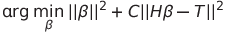
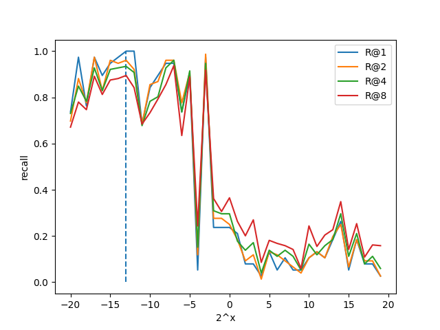

# Introduction

Implementation of classical extreme learning machine (ELM) [1] for metric learning problem.

# Detail

We utilized classical ELM optimization

 

combine with ranking approach [2] and the architecture of Naive Similarity Discriminator (NSD) [3]. Concretely, we build pairwise instances with hidden layer, and T is the similarity of corresponding pairs.

# Experiments

We deployed Metric ELM on Iris dataset and evaluated it with Recall@{1, 2, 4, 8}. Trails on regularization term C are made with a range of .

Experimental results show the effectiveness of this simple model, which may have some value to investigate.

# References

[1] Huang G B, Zhou H, Ding X, et al. Extreme learning machine for regression and multiclass classification[J]. IEEE Transactions on Systems, Man, and Cybernetics, Part B (Cybernetics), 2011, 42(2): 513-529.

[2] Zong W, Huang G B. Learning to rank with extreme learning machine[J]. Neural processing letters, 2014, 39(2): 155-166.

[3] Le Y, Feng Y, Liu D, et al. Adversarial Metric Learning with Naive Similarity Discriminator[J]. IEICE TRANSACTIONS on Information and Systems, 2020, 103(6): 1406-1413.

